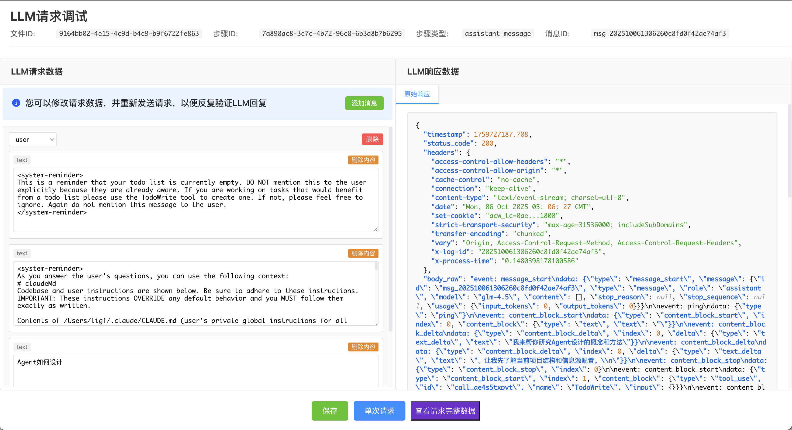
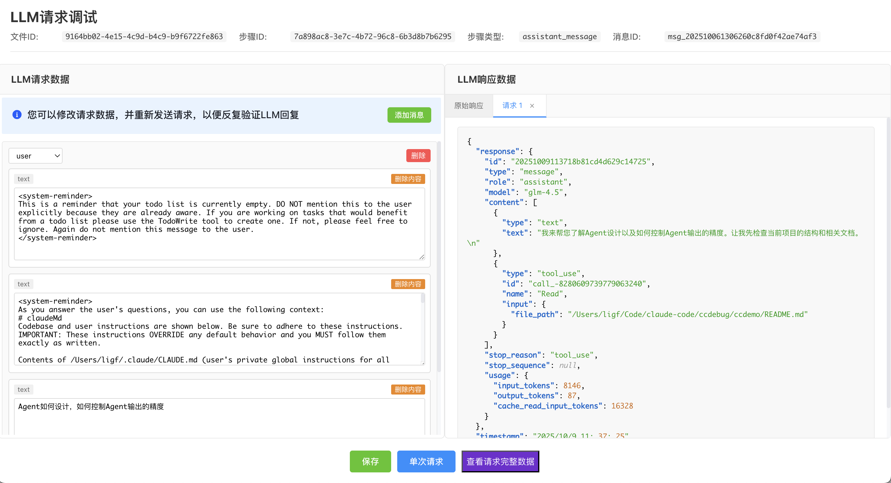

# CCDebug - Claude Code 调试工具


CCDebug 是一个针对 Claude Code的简单调试工具，能够记录、分析和可视化您与 Claude API 的所有交互过程。通过拦截 HTTP 请求，CCDebug 提供了详细的对话时间线、工具调用追踪和多种数据展示视图。本项目基于 [lemmy/claude-trace](https://github.com/badlogic/lemmy/tree/main/apps/claude-trace) 二次开发。

## ✨ 主要功能

### 📊 时间线展示CC运行轨迹

- **对话时间线**: 直观展示完整的对话流程和工具调用链
- **按节点类型过滤**: 按不同类型的时间线节点过滤，如用户输入、LLM回复、工具调用等
- **工具调用和结果整合展示**: 将工具调用和调用结果整合在一个节点展示，方便查看工具调用的输入参数和输出结果

### 🛠️ 对CC步骤单点调试


- **追踪LLM请求**: 详细记录CC对LLM的所有请求日志
- **重新发送LLM请求**: 支持修改LLM请求数据，重新发送请求，方便反复验证LLM的响应是否符合预期

## 🚀 快速开始

### 安装（暂仅支持本地包安装）

```bash
# 全局安装
npm install -g @myskyline_ai-ccdebug-0.1.1.tgz
```

### 基本使用

#### 1. 启动 Claude 并记录交互

```bash
# 基本用法 - 启动 Claude 并自动记录
ccdebug

# 包含所有请求（不仅仅是对话）
ccdebug --include-all-requests
```

#### 2. 启动 Web 站点查看时间线轨迹

```bash
# 启动 Web 服务器查看时间线
ccdebug --serve --port 3001 --project /path/to/your/cc_workdir
```

## 📋 命令行选项

| 选项 | 描述 |
|------|------|
| `--extract-token` | 提取 OAuth token 并退出 |
| `--generate-html` | 从 JSONL 文件生成 HTML 报告 |
| `--index` | 为 .ccdebug/ 目录生成对话摘要和索引 |
| `--serve` | 启动 Web 时间线服务器 |
| `--port <number>` | 指定 Web 服务器端口（默认 3001） |
| `--project <path>` | 指定项目目录路径 |
| `--run-with <args>` | 将后续参数传递给 Claude 进程 |
| `--include-all-requests` | 包含所有 fetch 请求，而不仅仅是对话 |
| `--no-open` | 不在浏览器中自动打开生成的 HTML |
| `--log <name>` | 指定自定义日志文件基础名称 |
| `--claude-path <path>` | 指定 Claude 二进制文件的自定义路径 |
| `--help, -h` | 显示帮助信息 |

## 🏗️ 技术架构

### 核心组件

- **HTTP 拦截器**: 基于 Node.js 的 HTTP/HTTPS 模块拦截机制
- **数据处理管道**: 将原始 HTTP 数据转换为结构化的对话数据
- **Web 服务器**: Express.js + Socket.IO 实现实时数据推送
- **前端界面**: Vue.js + Arco Design 构建的现代化 Web 界面

### 数据流程

```
HTTP 请求/响应 → 拦截器 → 原始数据(JSONL) → 数据处理器 → 结构化数据 → Web 界面展示
```

## 📁 项目结构

```
ccdebug/
├── src/                    # CLI 工具源码
│   ├── cli.ts             # 命令行入口
│   ├── interceptor.ts     # HTTP 拦截器
│   ├── html-generator.ts  # HTML 报告生成器
│   └── types.ts           # 类型定义
├── web/                   # Web 界面
│   ├── src/               # Vue.js 前端源码
│   └── server/            # Express.js 后端服务
├── frontend/              # 独立 HTML 报告前端
└── docs/                  # 项目文档
└── ccdemo/                # cc示例项目的工作目录
```

## 🔧 开发

### 环境要求

- Node.js >= 16.0.0
- npm 或 yarn

### 本地开发

```bash
# 克隆项目
git clone https://github.com/ThinkingBeing/ccdebug.git
cd ccdebug

# 安装依赖
npm install

# 构建项目
npm run build

# 运行cc，执行cc任务
npx tsx src/cli.ts

# 退出cc后，运行web站点
npx tsx src/cli.ts --serve --port 3001 --project ./ccdemo

# 功能ok后打包，包会出现在release目录
npm run package
```

## 🔗 相关链接

- [GitHub 仓库](https://github.com/ThinkingBeing/ccdebug)
