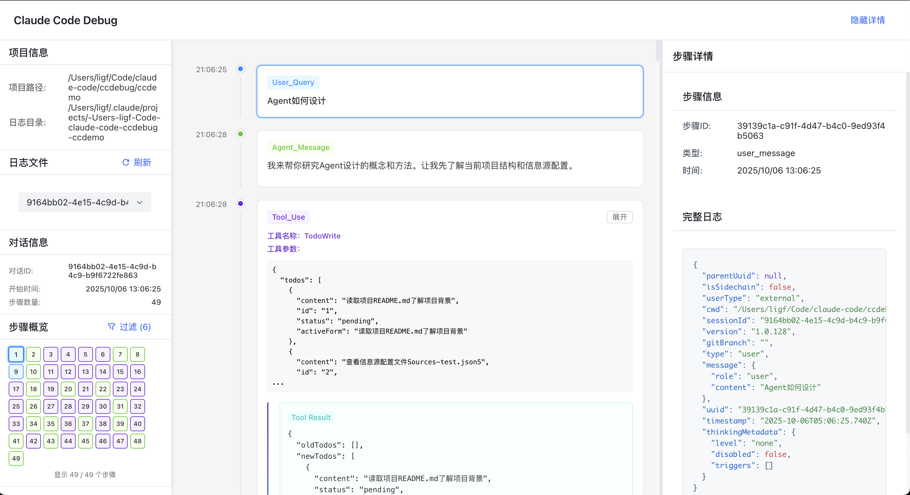

# CCDebug - Claude Code 调试工具


CCDebug 是一个针对 Claude Code 的调试工具，用于记录并可视化 CC 运行轨迹，同时支持对单个 LLM 请求进行“修改-重放”，帮助你快速定位提示词/上下文/工具调用导致的偏差。本项目基于 [lemmy/claude-trace](https://github.com/badlogic/lemmy/tree/main/apps/claude-trace) 二次开发。

英文版：[README.en.md](./README.en.md)

## ✨ 主要功能

### 📊 时间线展示CC运行轨迹

- **对话时间线**: 直观展示完整的对话流程和工具调用链
- **按节点类型过滤**: 按不同类型的时间线节点过滤，如用户输入、LLM回复、工具调用等
- **工具调用和结果整合展示**: 将工具调用和调用结果整合在一个节点展示，方便查看工具调用的输入参数和输出结果
- **会话选择与子代理识别**: 支持主日志会话选择，子代理日志下拉框显示 agent 名称/描述
- **项目切换**: Web 站点内可切换到 `~/.claude/projects` 下的其他项目，避免重复启动多个站点

### 🛠️ 对CC步骤单点调试


- **追踪LLM请求**: 详细记录CC对LLM的所有请求日志
- **重新发送LLM请求**: 支持修改LLM请求数据，重新发送请求，方便反复验证LLM的响应是否符合预期

## 🚀 快速开始

### 安装

```bash
# 推荐：从 npm 全局安装
npm install -g @myskyline_ai/ccdebug

# 或：安装本地/发布产物 tgz
# npm install -g /path/to/@myskyline_ai-ccdebug-x.y.z.tgz
```

### 基本使用

#### 1. 启动 Claude 并记录交互

```bash
# 基本用法 - 启动 Claude 并自动记录
ccdebug

# 包含所有请求（不仅仅是对话）
ccdebug --include-all-requests

# 将后续参数传递给 Claude 进程（示例）
ccdebug --run-with -p "请按要求工作" --verbose
```

#### 2. 启动 Web 站点查看时间线轨迹

```bash
# 启动 Web 服务器查看时间线（默认端口 3001，默认项目目录为当前目录）
ccdebug --serve

# 在自定义端口启动
ccdebug --serve --port 3001

# 指定项目目录启动
ccdebug --serve --project /path/to/your/cc_workdir
```

### 日志输出目录

- **CC 标准日志（用于时间线）**: `.claude-trace/cclog/*.jsonl`（包含主日志与 `agent-*.jsonl` 子代理日志）
- **CC API 跟踪日志（用于 LLM 请求调试）**: `.claude-trace/tracelog/*.jsonl`
- **已保存的 LLM 请求（用于覆盖/重放）**: `.claude-trace/tracelog/llm_requests/*.json`

说明：

- 运行 `ccdebug` 启动 Claude 会话后，会将本次会话对应的 CC 标准日志自动拷贝到 `.claude-trace/cclog/`，并将 API 跟踪日志重命名为 `{sessionId}.jsonl`。
- 如果你使用的是 Claude Code **原生二进制版本**（非 NPM 脚本形式），CCDebug 无法拦截 API 请求，LLM 请求调试能力将不可用（仍可通过 Web 站点查看已有 CC 标准日志）。

## 📋 命令行选项

| 选项 | 描述 |
|------|------|
| `--serve` | 启动 Web 时间线服务器 |
| `--log, -l` | 启动 Web 时间线服务器（当 `--log` 不带参数时等同于 `--serve`；建议用 `-l` 避免与 `--log <name>` 混淆） |
| `--port <number>` | 指定 Web 服务器端口（默认 3001） |
| `--project <path>` | 指定项目目录路径 |
| `--run-with <args>` | 将后续参数传递给 Claude 进程 |
| `--include-all-requests` | 包含所有 fetch 请求，而不仅仅是对话 |
| `--no-open` | 不在浏览器中自动打开生成的 HTML（当前仅对 `--generate-html` 生效） |
| `--claude-path <path>` | 指定 Claude 二进制文件的自定义路径 |
| `--log <name>` | 指定 API 跟踪日志基础名称（影响 `.claude-trace/tracelog/` 下文件名） |
| `--generate-html <input.jsonl> [output.html]` | 从 JSONL 文件生成 HTML 报告 |
| `--index` | 为 `.claude-trace/` 目录生成对话摘要和索引（会调用 Claude 产生额外 token 消耗） |
| `--extract-token` | 提取 OAuth token 并退出 |
| `--version, -v` | 显示版本信息 |
| `--help, -h` | 显示帮助信息 |

## 🏗️ 技术架构

### 核心组件

- **HTTP/API 拦截器**: 基于 Node.js 的 HTTP/HTTPS + fetch 拦截机制，记录对 Anthropic/Bedrock 的请求与响应
- **CC 标准日志整理**: 退出会话时自动将 CC 标准日志（主日志与子代理日志）拷贝到 `.claude-trace/cclog/`
- **Web 服务器**: Express.js 提供文件列表、会话管理、项目切换、LLM 请求读取/保存/重放等 API
- **前端界面**: Vue 3 + Vite + Pinia + Arco Design

### 数据流程

```
HTTP 请求/响应 → 拦截器 → 原始数据(JSONL) → 数据处理器 → 结构化数据 → Web 界面展示
```

## 📁 项目结构

```
ccdebug/
├── src/                     # CLI 与拦截器
│   ├── cli.ts              # 命令行入口
│   ├── interceptor.ts      # API 拦截与 tracelog 记录
│   ├── html-generator.ts   # HTML 报告生成器（基于 frontend）
│   └── index-generator.ts  # 对话摘要与索引生成
├── web/                     # Web 时间线站点（Vite + Vue 3）
│   ├── src/                # 前端源码
│   ├── dist/               # 构建产物
│   └── server/             # Express 后端（供 CLI 直接 require 启动）
├── frontend/                # 独立 HTML 报告前端（bundle 注入到 HTML）
├── scripts/                 # 打包脚本
└── docs/                    # 文档与设计说明
```

## 🔧 开发

### 环境要求

- Node.js >= 16.0.0
- npm 或 yarn

### 本地开发

```bash
# 克隆项目
git clone https://github.com/ThinkingBeing/ccdebug.git
cd ccdebug

# 安装依赖
npm install

# 构建项目
npm run build

# 开发模式（同时 watch 核心代码 + 前端）
npm run dev

# 使用 tsx 直接运行 CLI（开发调试用）
npx tsx src/cli.ts --help
npx tsx src/cli.ts --serve --port 3001 --project /path/to/your/cc_workdir

# 功能ok后打包，包会出现在release目录
npm run package
```

## 🔗 相关链接

- [GitHub 仓库](https://github.com/ThinkingBeing/ccdebug)
